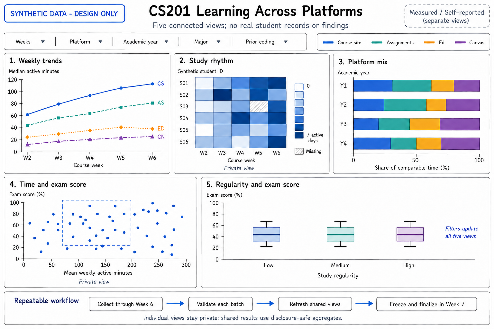

# CS201 Across Platforms: Study Habits and Exam Outcomes

**STATS 401 Final Group Project Proposal**

**Group members:** Zaozao Wang and Zhengxiang Liu

## 1. Topic, Goals, and Questions

CS201 students study through several websites. We will investigate how their online study patterns relate to examination performance. Our audience is students, teaching assistants, and instructors seeking to understand resource use and improve learning support.

Five coordinated views will connect platform use, study timing, background, and outcomes. We ask:

- How does each platform's recorded usage relate to final examination scores?
- Do consistent study patterns and concentrated late-term activity show different associations with performance?
- How does students' distribution of time across platforms change throughout the course?
- Do these patterns differ by academic year, major, or prior programming experience?

Time online imperfectly measures learning; this observational study cannot establish causation.

## 2. Datasets

We will build a longitudinal dataset, adding weekly batches through Week 6.

**Platform activity.** Sources are our [CS201 course website](https://vcm-53362.vm.duke.edu:3300), the [Repolab assignment platform](http://repolab.colab.duke.edu:8005/) (course access to be confirmed), [Ed Discussion](https://edstem.org/), and [Duke Canvas](https://canvas.duke.edu/). We plan authorized CSV/JSON exports from our website and instructor-provided exports or permitted APIs for other platforms, subject to availability. Fields include pseudonymous student ID, platform, date/week, estimated active minutes, activity counts, coverage start, and measurement source.

Our intended duration measure counts visible, focused activity, pausing after inactivity. We will verify deployed coverage; historical data are not assumed. Ed/Canvas activity counts cannot establish duration; weekly diaries can supply separately labeled self-reports. Cross-platform time shares require comparable, non-overlapping measurements; otherwise, comparisons remain platform-specific.

**Background and outcomes.** A voluntary questionnaire will collect academic year, major, and prior programming experience; gender is optional and exploratory. With instructor authorization and informed participation, examination scores will be supplied separately and joined using an instructor-held linkage key.

For planning, 40 participants across four platforms and four collection weeks yield up to 640 student-platform-week rows with approximately 15 variables, plus 40 background/outcome rows. These are estimates, not collected results.

Reusable cleaning will validate schemas, deduplicate exports, standardize units and week boundaries, check impossible durations, and preserve missingness and coverage flags. Missing records will not automatically become zero. Raw records, linkage keys, and individual grades will stay outside GitHub; public outputs will use aggregates that protect participants, suppressing small groups.

## 3. Analysis and Visualization Methods

Python with pandas will produce validated CSV/JSON tables; JavaScript, D3.js, HTML, and CSS will implement the dashboard. Synthetic fixtures will use a fixed seed and the real-data schema.

We will derive weekly platform minutes, active days divided by observed days, and the activity share in the final two collection weeks. Only pre-examination activity enters score comparisons. Descriptive summaries and Spearman correlations will examine relationships with scores. If sample size permits, exploratory regression will adjust for prior programming experience. Student-level summaries and bootstrap resampling will avoid treating repeated weeks as independent students. We will report sample sizes, coverage, missing scores, self-selection, and unmeasured offline study.

Shared week, platform, background, and measurement-source filters will support comparison, trend discovery, subgroup exploration, and outlier inspection. Brushing and tooltips will link views. Individual-level exploration will remain private; public views will aggregate records. We will use accessible colors, explicit labels, keyboard-operable filters, and clear empty states.

## 4. Visualization Sketches

The original sketch below uses synthetic data only and presents no findings. Its numbered panels correspond to these five distinct designs; no external visual references are used.

| Panel | Technique | Purpose |
| --- | --- | --- |
| 1 | Multi-line chart | Compare weekly platform usage to identify changing resource preferences and activity peaks. |
| 2 | Heatmap | Reveal regular versus concentrated activity across students and weeks, keeping missing coverage visibly distinct. |
| 3 | 100% stacked bar chart | Compare platform time shares across academic years when duration measurements are comparable. |
| 4 | Scatterplot | Explore platform-specific study time versus examination scores and inspect unusual combinations. |
| 5 | Box-and-whisker plot | Compare score distributions across predefined study-regularity bands while showing variability. |

## 5. Group Roles and Responsibilities

**Zaozao Wang** will lead source coordination, acquisition, cleaning, and analysis. **Zhengxiang Liu** will lead visualization design, D3 implementation, interactions, and webpage integration. Both will review definitions, test the pipeline, interpret results, document decisions, and prepare and deliver the presentation. Both members will understand and contribute to the complete system.

## 6. Interim Demonstration Deliverables

By the interim demonstration, we will show a working import-to-dashboard framework: a data dictionary, collection/access status, reusable cleaning checks, preliminary exploration, refined questions, five visualization designs, and at least two linked D3 views. Explicitly labeled synthetic fixtures will demonstrate filtering, missing data, and invalid-input handling. We will import an available authorized real batch if possible, while keeping synthetic demonstrations separate from empirical findings.

## 7. Timeline and Milestones

Collection continues through Week 6. Cleaning rules are implemented early and run on every batch; Week 7 concentrates on final reconciliation and analysis.

| Week | Milestone | Tasks | Leads | Expected output |
| --- | --- | --- | --- | --- |
| 2 | Project definition | Confirm questions, access, consent, schema, and sketches. | Zaozao Wang + Zhengxiang Liu | Proposal and collection plan. |
| 3 | Framework foundation | Begin collection; build import adapters, synthetic fixtures, and D3 shell. | Zaozao Wang: data; Zhengxiang Liu: interface | Reusable pipeline and dashboard scaffold. |
| 4 | Connected prototype | Continue collection; validate batches, explore coverage, implement linked views. | Zaozao Wang: processing; Zhengxiang Liu: charts | Cleaned samples and working interactions. |
| 5 | Interim demonstration | Present framework, initial D3 views, refined questions, and data gaps. | Zaozao Wang + Zhengxiang Liu | Demonstration and feedback notes. |
| 6 | Implementation and refinement | Continue collection; complete five views and usability checks. | Zaozao Wang: data; Zhengxiang Liu: integration | Complete dashboard and collection snapshot. |
| 7 | Final integration | Freeze activity data; reconcile, clean, join available scores, analyze, document, and present. | Both: review, analysis, delivery | Validated final tables, visualizations, and presentation. |

If final scores arrive after the deadline, we will present the framework and available activity analyses, explicitly defer score comparisons, and retain a tested import path.

**LLM Usage Disclosure:** Codex assisted with proposal drafting; imagegen generated the original conceptual sketch. All illustrated values are synthetic.
